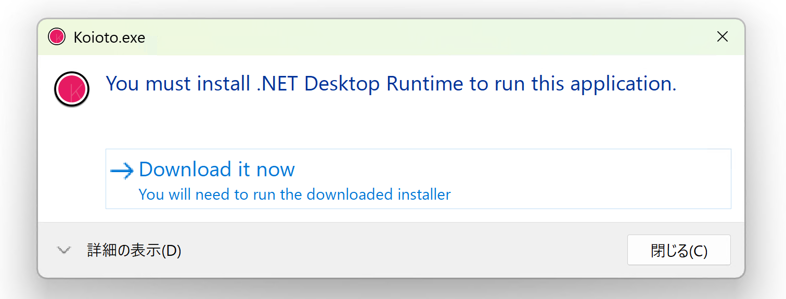

Koioto は Windows PC 上で動作することを想定して制作されています、それ以外の環境での動作は想定されていません。Windows PC 以外はサポート外となります。

## 必須環境

以下の条件をクリアしていれば、Koioto を起動することができます。

- Windows 10 (22H2) 以降の Windows 10, 11
- .NET 10 ランタイムまたは SDK
- 64 ビットの CPU
- DirectX 11 に対応した GPU

## 推奨環境

ここでは、Koioto を快適に利用できるための推奨環境を掲載します。

- Windows 11 (22H2) 以降
- .NET 10 ランタイムまたは SDK
- CPU: 2.5GHz 以上で、クアッドコア以上
- メモリ: 8GB 以上
- GPU: GTX 750Ti 以上の性能を持つもの
- ディスプレイ: 1920 x 1080 以上、リフレッシュレートが 120 Hz 以上のディスプレイ (垂直同期をする場合)

Koioto を録画したり、配信したりする場合、高速なストレージやネットワーク回線が必要になる可能性もあります。

## .NET ランタイムについて

Ver.1.1 以降の Koioto では、.NET 10 ランタイムまたは SDK が動作に必要となります。

.NET ランタイムがインストールされていない場合、Koioto を起動すると上記のメッセージが表示されます。このメッセージが表示された場合は、「Download it now」をクリックして .NET ランタイムのダウンロードとインストールができます。

メッセージが表示されずに Koioto が起動する場合は、ランタイムが既にインストールされています。そのままお使いいただけます。

## Koioto の動作が重いときは……？

- バックグラウンドで他のソフトウェアが処理をしていないかどうか確認してください。とくに、ウィルス対策ソフトのスキャンやクラウドストレージの同期はソフトウェアの動作に支障をきたすかもしれません。
- スペック不足、という可能性もあるので [Discord サーバー](https://discord.gg/kaF5Nc6)で相談してみるのも良いでしょう。